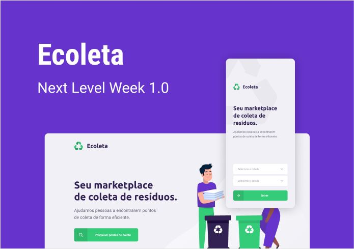

# NLW-01-Ecoleta
Projeto desenvolvido durante a Next Level Week 01, ministrada pela Rocketseat.

## :computer: O Projeto
O Ecoleta é um projeto multiplataforma que tem como objetivo conectar pessoas à companhias de coleta de resíduos.
<p align="center">
  
</p>

## :rocket: Ferramentas
As tecnologias listadas abaixo foram utilizadas no projeto.
- [Node.js](https://nodejs.org/en/)
- [React](https://pt-br.reactjs.org)
- [React Native](https://reactnative.dev)
- [Typescript](https://www.typescriptlang.org)
- [Expo](https://expo.io)
- [Express](https://expressjs.com/pt-br/)

## :information_source: Instruções para clone
### Configuração da API
```git
$ git clone https://github.com/luis291099/NLW-01-Ecoleta.git

$ cd NLW/server

$ npm install

$ npm knex:migrate

$ npm knex:seed

$ npm dev
```

### Configuração do Front-end
```
$ git clone https://github.com/luis291099/NLW-01-Ecoleta.git

$ cd NLW/web

$ npm install

$ npm start

```

### Configuração Mobile
```
$ git clone https://github.com/luis291099/NLW-01-Ecoleta.git

$ cd NLW/mobile

$ npm install

$ npm start

```
